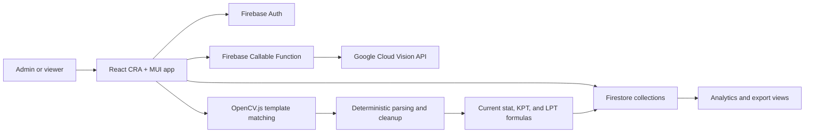

# The Last Land OCR Analytics Platform

The Last Land is a real-workflow OCR analytics platform for alliance stats, formations, and battle reports. It converts game screenshots into structured Firebase data using Google Cloud Vision OCR, OpenCV template matching, deterministic parsing, and analytics dashboards.

This repository is intentionally treated as a production-sensitive app because it is used with real data.

## What It Does

- Extracts player stat screenshots into structured stat records.
- Uses Google Cloud Vision through Firebase Cloud Functions for OCR.
- Uses OpenCV.js template matching to locate troop report rows from screenshots.
- Stores stats, formations, reports, settings, and analytics in Firestore.
- Computes derived combat metrics plus KPT and LPT summaries.
- Supports admin-only writes and view-only access for non-admin users.
- Exports tabular data for spreadsheet workflows.

## Data Safety Rule

Do not change parsing, formulas, Firebase collection shapes, report aggregation, or export formats without a regression test and explicit approval.

Protected files include:

- `src/utils/parseData.js`
- `src/utils/calcs.js`
- `src/utils/dbActions.js`
- `src/components/report/ReportPage.jsx`
- `src/components/analytics/AnalyticsPage.jsx`
- `src/components/analytics/AnalyticsSummary.jsx`
- `src/components/stats/DataTable.jsx`

## Architecture



More detail:

- [Architecture](docs/ARCHITECTURE.md)
- [Calculation Audit](docs/CALCULATION_AUDIT.md)
- [Data Safety, Firestore Contract, Admin Security, and Fixtures](docs/DATA_SAFETY.md)
- [Deployment](docs/DEPLOYMENT.md)
- [Roadmap and Refactor Plan](docs/ROADMAP_AND_REFACTOR.md)

## Tech Stack

- React 19 with Create React App
- Material UI
- Firebase Auth
- Firebase Firestore
- Firebase Cloud Functions for Python
- Google Cloud Vision API
- OpenCV.js
- Jest and React Scripts test runner

## Local Development

```bash
npm install
npm start
```

Local app:

```bash
http://localhost:3000
```

Production Firebase remains the default unless emulator mode is explicitly enabled.

## Local Data Testing With Emulators

Use this path when testing parser, report, analytics, or UI changes without touching real Firebase data.

Terminal 1:

```bash
npm.cmd run emulators
```

Terminal 2:

```bash
npm.cmd run seed:emulators
```

Terminal 3:

```bash
npm.cmd run start:emulators
```

`start:emulators` checks that Auth and Firestore emulators are reachable before launching React. It defaults the local app to `http://localhost:3001` to avoid conflicts with other CRA apps on port 3000.

The seed script writes synthetic data only to the Firestore emulator.

Report extraction in emulator mode still uses the production Google Vision-backed OCR endpoint, but all app reads and writes use local Auth and Firestore emulators. This keeps extraction behavior aligned with production without requiring local `gcloud`, service account JSON files, or the Functions emulator.

In PowerShell, use `npm.cmd` instead of `npm` if script execution policy blocks `npm.ps1`.

## Tests

```bash
npm test -- --watchAll=false
```

Current tests are characterization tests. They lock down existing parser, calculator, and export-helper behavior so future refactors do not accidentally change real data workflows.

Sanitized fixtures live in `src/testFixtures/lastLandFixtures.js`. They intentionally avoid real player identities, alliance data, screenshots, and Firebase exports.

## Build

```bash
npm run build
```

## Firebase Functions

```bash
cd functions
pip install -r requirements.txt
cd ..
firebase deploy --only functions
```

## Production Direction

The strongest next steps are not UI-heavy. They are:

- Add fixture-based OCR/parser regression tests using representative screenshots.
- Move admin authorization from hardcoded email lists toward custom claims or a Firestore role document.
- Add extraction confidence and manual review states without changing current parsing output.
- Migrate carefully from CRA to Vite + TypeScript only after behavior is locked by tests.
- Document Firebase rules and collection contracts before changing access control.
